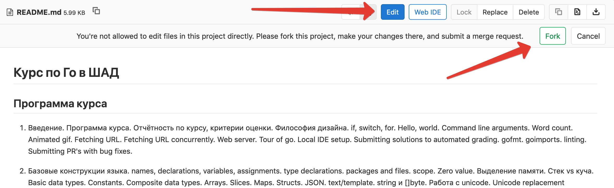

# Как послать патч

Если вы нашли недоработку в тестах или неточность/опечатку в условии, то вы можете послать MR
с исправлением в репозиторий курса.

За все исправления начисляются доб-баллы в колонке bugs в таблице. Размер доп-баллов зависит от
серьёзности исправления и определяется преподавателями.

## Небольшие исправления

Небольшие исправления на <10 строк проще всего послать через веб интерфес гитлаба.

1. Откройте нужный файл в веб интерфейсе репозитория https://gitlab.com/slon/shad-go
2. Нажмите на кнопку "Edit". Во всплывающей подсказке нажмите кнопку "Fork".
   
3. Внесите изменения в файл. Нажмите "Commit Changes" внизу страницы.
4. Добавьте описание вашего изменения. Нажмите "Submit Merge Request".
