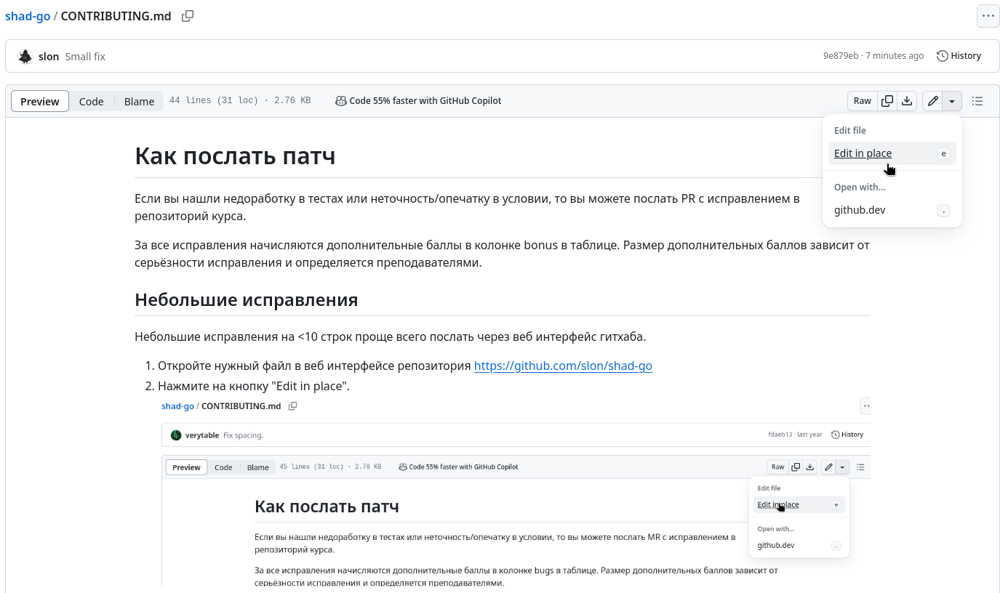

# Как послать патч

Если вы нашли недоработку в тестах или неточность/опечатку в условии, то вы можете послать PR
с исправлением в репозиторий курса.

За все исправления начисляются дополнительные баллы в колонке bonus в таблице.
Размер дополнительных баллов зависит от серьёзности исправления и определяется преподавателями.

## Небольшие исправления

Небольшие исправления на <10 строк проще всего послать через веб интерфейс гитхаба.

1. Откройте нужный файл в веб интерфейсе репозитория https://github.com/slon/shad-go
2. Нажмите на кнопку "Edit in place".
   
3. На следующем экране нажмите "Fork this repository".
3. Внесите изменения в файл. Нажмите "Commit Changes" сверху страницы.
4. Добавьте описание вашего изменения. Нажмите "Propose changed".
5. Нажмите "Create pull request".

## Продвинутые исправления

Для многофайловых исправлений можно сначала сделать исправление локально:

1. Создайте форк https://github.com/slon/shad-go аналогично тому, что выше.

2. Закоммитьте все локальные изменения, которые вы не хотите добавлять в репозиторий курса.

3. Создайте новую локальную ветку со свежей версией кода из репозитория курса:
   ```
   git fetch origin
   git checkout origin/master -b newbranchforupdate
   ```

4. Внесите локальные изменения и запушьте их в свой форк на [github.com](https://github.com/) (не в `student`), например
   ```
   git add .
   git commit -m "Update tests"
   git push https://gitlab.com/%USERNAME%/shad-go/
   ```

5. В своём форке выберите созданную ветку и создайте Pull Request в репозиторий курса. Обычно Github подсказывает недавно запушенную ветку и предлагает создать для неё PR.

   На странице c формой нового Pull Request убедитесь, что ветвь назначения — `slon/shad-go:master`. Нажмите кнопку "Create Pull Request".
