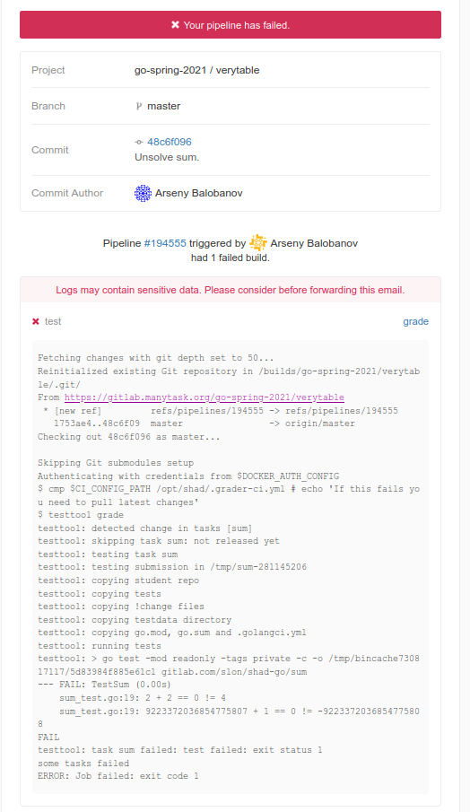

## ciletters

В этой задаче вам предстоит познакомиться со стандартным пакетом [text/template](https://golang.org/pkg/text/template/),
позволяющим генерировать текст в определенном формате, а также с пакетом [embed](https://pkg.go.dev/embed),
позволяющим вкомпиливать в исполняемый файл строковые литералы.

### Легенда

В gitlab можно подписаться на различные события: успешный build, новый комментарий, решённое issue и др.
Вот так, например, выглядит нотификация о сломанном pipeline'е:



В задаче предлагается сгенерировать письмо подобного содержания в текстовом виде.

Для генерации HTML в языке также имеется стандартный пакет [html/template](https://golang.org/pkg/html/template/).
Работа с ним аналогична работе с `text/template`, поэтому для простоты в задаче был выбран текстовый формат.

### Что нужно сделать?

Нужно реализовать функцию `MakeLetter` из файла [letter.go](./letter.go),
которая по go объекту нотификации генерирует её текстовое представление.

Для этого нужно написать `text/template` шаблон, сохранить его в отдельный файл, а затем получить его содержимое в коде с помомщью `go:embed`.

#### Прокомментированный пример из теста
```
Your pipeline #194613 has failed! // 194613 -- это ID pipeline'а
    Project:      go-spring-2021/gopher // Project состоит из ID группы и ID проекта
    Branch:       🌿 master
    Commit:       8967153e Solve urlfetch. // Первые 8 байт хэша коммита.
    CommitAuthor: gopher
        // Здесь происходит цикл по всем сломанным job'ам
        Stage: test, Job grade // test -- это имя stage'а, а grade -- имя job'а
            // Далее идут последние 10 строк лога gitlab runner'а
            testtool: copying go.mod, go.sum and .golangci.yml
            testtool: running tests
            testtool: > go test -mod readonly -tags private -c -o /tmp/bincache730817117/5d83984f885e61c1 gitlab.com/slon/shad-go/sum
            --- FAIL: TestSum (0.00s)
                sum_test.go:19: 2 + 2 == 0 != 4
                sum_test.go:19: 9223372036854775807 + 1 == 0 != -9223372036854775808
            FAIL
            testtool: task sum failed: test failed: exit status 1
            some tasks failed
            ERROR: Job failed: exit code 1
```

Объект нотификации описан в [notification.go](notification.go).
Обратите внимание на `//go:build !change`.
Этот файл менять не нужно, и на сервере будет использоваться оригинальный вариант.

В реализации нужно подогнать `text/template` шаблон под требуемый вывод. Функция должна использовать один шаблон.
Использовать `fmt.Sprintf` или конкатенацию строк нельзя.

Вам могут понадобиться:
* условные блоки (`if/else`)
* range'и
* кастомные функции в шаблоне: https://golang.org/pkg/text/template/#FuncMap
* `'-'` для удаления пробелов

### Проверка решения

Для запуска тестов нужно выполнить следующую команду:
```
go test -v ./ciletters/...
```
