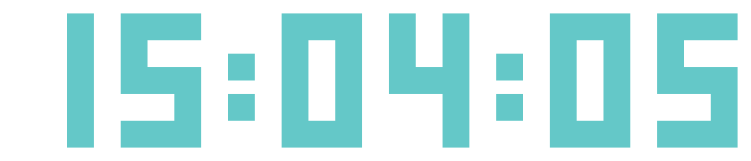

## digitalclock

В этой задаче нужно написать http server,
который по запросу `/?time=hh:mm:ss` вернет PNG с данным временем.

Сервер должен слушать порт, переданный через аргумент `-port`.

### Примеры

Запуск:
```
$ digitalclock -port 6029
```

После запуска можно открыть в браузере `http://localhost:6029/?time=15:04:05` и получить png наподобие этой:


Если параметр `time` не задан (или равен ""), сервер должен вернуть текущее время.
В этом случае при обновлении страницы картинка должна меняться.

В запросе также нужно поддержать параметр 1 <= `k` <= 30,
который отвечает за увеличение картинки в `k` раз:

http://localhost:6029/?time=15:04:05&k=15



На невалидных `time` и `k` сервер должен возврщать произвольное сообщение об ошибке и http status 400 (Bad Request):

```
$ curl -i "http://localhost:6029/?k=100" 
HTTP/1.1 400 Bad Request
Content-Type: text/plain; charset=utf-8
X-Content-Type-Options: nosniff
Date: Fri, 14 Feb 2020 02:02:41 GMT
Content-Length: 10

invalid k
```

В случае успеха приложение должно возвращать http status 200 (OK),
а также проставлять http header `Content-Type: image/png`:

```
$ curl -i "http://localhost:6029/"                   
HTTP/1.1 200 OK
Content-Type: image/png
Date: Fri, 14 Feb 2020 02:08:19 GMT
Content-Length: 193
...
```

### Формат

`hh:mm:ss`

В [./symbols.go](./symbols.go) определены строковые константы, кодирующие цифры и двоеточие.
Один символ константы (отличный от '\n') - 1 пиксель.
'.' должны кодироваться в белый цвет, '1' - в бирюзовый (переменная **Cyan** в [./symbols.go](./symbols.go)).
Все константы имеют одинаковую высоту `h`, все цифры имеют одинаковую ширину `w`.

`k` отличный от 1 (default) превращает каждый пиксель `p` картинки в блок `k x k` пикселей `p`.
Высота результирующей картинки - `h * k`, ширина - `(6 * w + 2 * w_colon) * k`,
где `w_colon` ширина константы, соответствующей ':'.

### Проверка решения

Для запуска тестов нужно выполнить следующую команду:

```
go test -v ./digitalclock/...
```

### Запуск программы

```
go run -v ./digitalclock/... -port 6029
```

### Компиляция

```
go install ./digitalclock/...
```

После выполнения в `$GOPATH/bin` появится исполняемый файл с именем `digitalclock`.

### Walkthrough

1. парсинг аргументов командной строки https://gobyexample.com/command-line-flags
2. http server: https://p.go.manytask.org/00-intro/lecture.slide#23
3. url params: https://golang.org/pkg/net/url/#URL.Query
3. форматирование времени: https://gobyexample.com/time-formatting-parsing
4. работа с картинками: https://golang.org/pkg/image/

Пример, создания простой png размера 5x5:
```go
package main

import (
        "image"
        "image/color"
        "image/png"
        "os"
)

func main() {
        img := image.NewRGBA(image.Rect(0, 0, 5, 5))
        img.Set(2, 2, color.RGBA{255, 0, 0, 255})
        f, _ := os.Create("/tmp/img.png")
        png.Encode(f, img)
}
```
