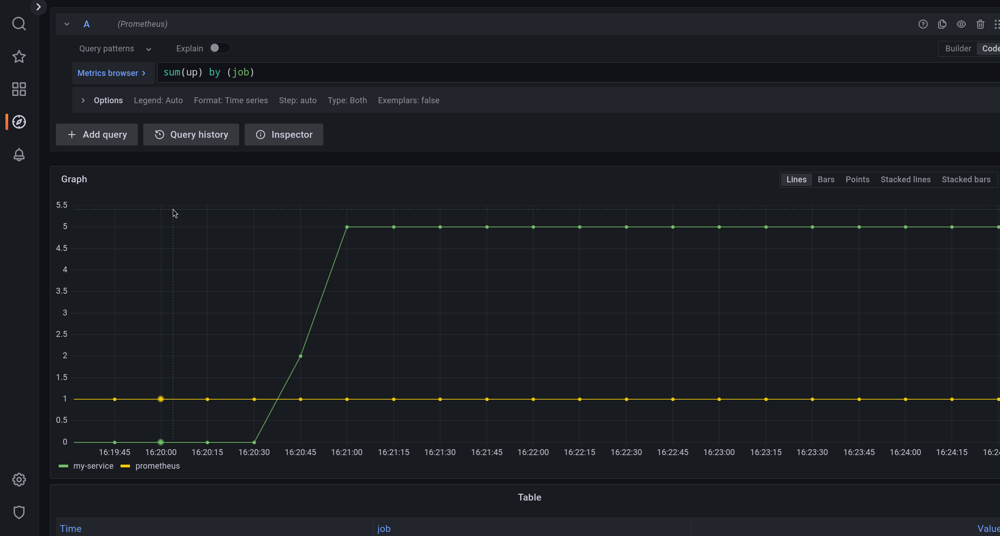

# firegod

В этой задаче вам нужно научиться пользоваться связкой prometheus+grafana для отладки собственного кода.

Вам дан код сервиса. Нужно добавить в него метрики, и потом используя графану с помощью графиков ответить на ряд вопросов.

В этой задаче нет автоматической проверки. Чтобы получить оценку, нужно закоммитить свои ответы вместе со скриншотами в репозиторий, и поменять значение константы в `Solved` в файле `main.go` на `true`.

## Окружение

В файле `docker-compose.yaml` описан тестовый стенд.

- `prometheus` - контейнер с прометеем, который собирает метрики и выполняет запросы над ними.
- `grafana` - контейнер с графаной, дающий удобный `Web UI` для работы с прометеем.
- `my_service` - 5 реплик вашего сервиса.

Чтобы запустит тестовый стенд, выполните команду `docker compose up --build`. Чтобы перезапустить стенд, остановите `docker compose` нажав `Ctrl+C` и перезапустите команду.

После запуска стенда, проверьте что:
  - [targets](http://localhost:9090/targets) показывает правильный список процессов. Один прометей в состоянии `up` и 5 копий вашего сервиса в состоянии `down` с ошибкой `server returned HTTP status 404 Not Found`.
  - [grafana](http://localhost:3000/explore) пускает вас в интерфейс с логином `admin` и паролем `grafana`, а на странице Explore видно какие-то метрики (например `up`).

## Сервис

В пакете `dontlook` находится код сервиса. В него смотреть *нельзя*.

Вам нужно дописать код сбора и экспорта метрик в файл `main.go`.

1. Сделайте так, чтобы метрики экспортировались по запросу `GET /metrics`.
2. Включите экспорт метрик go рантайма и процесса (если они уже не экспортируются по дефолту).
3. Добавьте middleware записывающий метрики из http хендлеров.

## Вопросы

1. Сколько процессов каких сервисов подключено к прометею? (пример)

**Ответ**: 1 прометей и 5 моих сервисов.

2. Какой процесс постоянно перезапускается?

3. В каком процесс есть утечка файловых дескрипторов?

4. В каком процессе есть утечка памяти?

5. В каком процессе утекают горутины?

6. Какой хендлер пятисотит больше всех?

7. Сколько всего запросов в секунду приходит в сервис?

8. Какой хендлер медленнее всех отвечает, если сравнивать по 90-ой перцентиле времени ответа?

9. Какой хендлер генерирует больше всего трафика?
