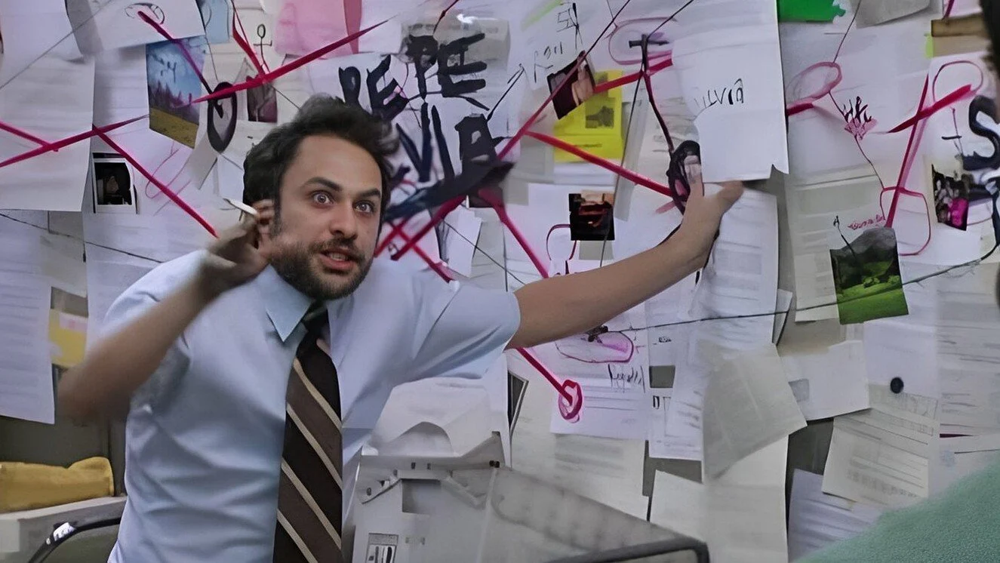

## psycher

В данной задаче необходимо реализовать 128-битный линейный [блочный шифр](https://ru.wikipedia.org/wiki/Блочный_шифр). Этот cipher назван в честь psycho, придумавшего эту задачу.

### Шифрование за 5 минут

Шифрование - это способ обмена информацией так, чтобы противник, стоящий посередине, не узнал **ничего**. 

Для такого свойства необходим секрет, которым владеют участники обмена информацией. Этот секрет может быть общим для обоих участников, тогда соответствующий шифр называется **симметричным** (примеры: aes, des). Если же ключи разные, то шифрование **асимметричное** (примеры: rsa, ecdsa).

С помощью секрета делается хитрое преобразование информации и передается собеседнику. Собеседник дешифрует со своим секретом и узнает, что было передано. Противник посередине видит преобразованное значение и ничего не понимает.

Блочный шифр - это разновидность симметричного шифра. Отличительная особенность в том, что имеется простой интерфейс - принять блок данных фиксированного размера (обычно 64-256 бит) и зашифровать/дешифровать его. По сути шифр - функция {0,1}^n -> {0,1}^n, причем такая, что значение на выходе *не отличимо* от рандомно сгенерированного значения

Для шифрования данных произвольного размера используются режимы шифрования. По сути данные разбиваются на привычные блоки для блочного шифра, шифруются им и комбинируются хитрым образом (комбинирование и есть суть режима шифрования). По сути результат шифрования более поздних блоков зависит от предыдущих. Такую зависимость нужно вводить, чтобы не показывать противнику паттерны в данных от блоков. (режимы шифрования в задаче не потребуются, это рассказано просто в образовательных целях)

### Легенда psycher

Представьте себе пространство {0,1}^128 над полем {0,1}. А теперь давайте возьмем в нем какой-нибудь базис и будем переводить в него векторы из тривиального базиса [{1, 0, 0, ...}, {0, 1, 0, ...}, ...]

Вы спросите, зачем нам это делать? А теперь я расскажу что придумал


Выбранный базис в виде 128 векторов размерности 128 будет нашим симметричным ключом. Шифрование данных - это перевод вектора в этот базис. Дешифрование - обратное преобразование.

При выборе произвольного базиса результат преобразования будет определенно неотличим от произвольной последовательности бит (ну, кроме нулевого вектора). То есть получился полноценный шифр!

Вообще теория говорит, что линейные шифры - это некруто и на практике их не так сложно взломать, как кажется. Но зато такой шифр отлично подходит для оттачивания навыков с курса :)

### Я программист, можно на человеческом?

Да, можно. При создании объекта шифра нам передается список из 128 значений, каждое - 128 бит (нигде не проверяется, но давайте считать, что данные представляют собой линейно независимые векторы).

При шифровании нужно сделать следующее:
1. Собираем все позиции в битовом представлении входных данных (128-битный блок)
2. Применяем xor всех значений с данными позициями из списка инициализации объекта
3. Возвращаем результат

Более того, этот функционал уже реализован в тестовом файле.

Для дешифрования нужно решать систему линейных уравнений. Это скучно, давайте не реализовывать дешифрование.

### Ничего не понял, а задача-то в чем?

А предоставленное решение-то медленное. Надо его ускорить.

Здесь вам помогут знания об оптимизациях компилятора, умение работать с бенчмарками и pprof.

Авторское решение лучше наивного примерно в 3 раза.

```
cpu: Intel(R) Core(TM) i7-9850H CPU @ 2.60GHz
BenchmarkSlowCipher
BenchmarkSlowCipher-12    	  989001	      1209 ns/op	  13.23 MB/s	       0 B/op	       0 allocs/op
BenchmarkCipher
BenchmarkCipher-12        	 2786650	       396.2 ns/op	  40.39 MB/s	       0 B/op	       0 allocs/op
PASS
```


