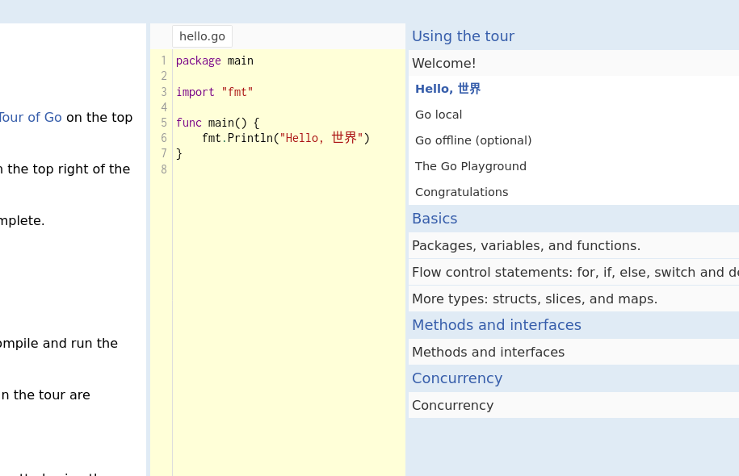

# tour of go

Пройдите первую часть (Basics) tour of go на [сайте](https://tour.golang.org/welcome/1).

После того, как вы пройдёте все задачи, пошлите флаг `FLAG{tour0:gopher:9b82d50468bd79610f28ae57eb5cafcd}` в [систему](https://go.manytask.org/submit).

