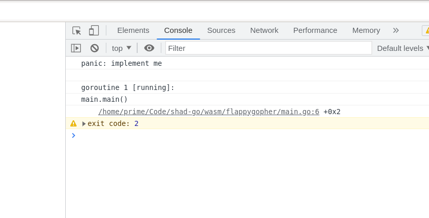
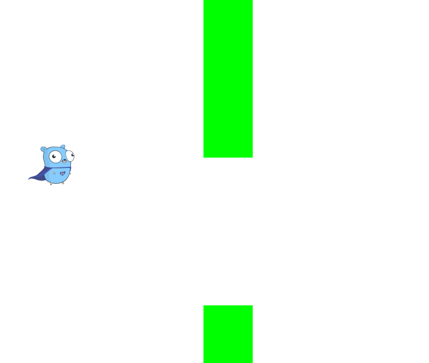

# wasm

В этой задаче вам нужно научиться запускать go в браузере и работать с API браузера.

Автоматических тестов в задаче нет, нужно решить задачу, поменять константу в файле `done.go`
и послать код в систему. Мы проверим код глазами. Если задача не решена на самом деле,
мы умножим оценку на -1.

## Сборка и запуск

Код нужно писать в файле `flappygopher/main.go`. Чтобы собрать код, нужно выставить переменные окружения
`GOOS` и `GOARCH`. Обычно `GOOS` (читается как гус) задаёт операционную систему, под которую нужно собрать
код. А `GOARCH` задаёт архитектуру процессора, под которую нужно собрать код.

В данном случае, код собирается для браузера и сохраняется в формате WASM.

```
# Внутри директории wasm/flappygopher
env GOOS=js GOARCH=wasm go build -o flappygopher.wasm
```

В директории `flappygopher` находится отдельный go модуль, чтобы его можно было открыть как отдельный проект.
Отдельный проект позволяет настроить `GOOS` и `GOARCH`, так чтобы в IDE работал автокомплит.
Чтобы настроить эти переменные в vscode, нужно выставить настройку `go.toolsEnvVars`.
В других IDE, ищите инструкцию сами.

```
prime@fedora ~/C/s/w/flappygopher (master)> cat .vscode/settings.json
{
    "go.toolsEnvVars": {
        "GOOS": "js",
        "GOARCH": "wasm",
    }
}
```

После того как вы собрали код, нужно запустить web сервер для раздачи файлов. Проще всего
воспользоваться питоном.

```
prime@fedora ~/C/s/w/flappygopher (master)> python3 -m http.server
Serving HTTP on 0.0.0.0 port 8000 (http://0.0.0.0:8000/) ...
```

Перейдите по ссылке и откройте инструменты разработчика. В `javascript` консоли вы должны увидеть
сообщение об ошибке. На линуксе консоль открывается комбинацией `Ctrl+Shift+i`.



Если ошибка такая как на скриншоте (паника из го) - то все хорошо. Если какая-то другая, то
значит у вас проблемы с окружением.

Поправьте код, уберите панику и вставьте `fmt.Println("Hello, JS")`. Пересоберите код.
Обновите страницу в браузере. (питон сервер должен работать в отдельной вкладке, перезапускать его не нужно). 
Ошибка должна уйти и вместо неё появиться ваше сообщение.

## Файлы с исходным кодом

В проекте есть несколько файлов. Вам нужно понимать их смысл.

 - `index.html` - эта та страница, которую открывает браузер. Этот файл менять не нужно.
   В начале файла записан код, который загружает, инициализирует и запускает WASM файл.
 - `wasm_exec.js` - код на js, который распространяется вместе с go тулчейном. Этот код настраивает
   взаимодействие с go со стороны js. Внутрь wasm модуля нельзя положить js код,
   а какой-то js код для bootstrap всего Go рантайма нужен. Поэтому этот код
   распространяется как отдельный файл.
 - `main.go` - ваш код на go, который будет загружен и запущен. Внутри будет вызвана
   функция `main`. Код внутри `main.go` может использовать пакет [`syscall/js`](https://pkg.go.dev/syscall/js) для взаимодействия
   с браузером. Также можно использовать пакеты [`honnef.co/go/js/dom/v2`](https://pkg.go.dev/honnef.co/go/js/dom/v2)
   и [`console`](./console/console.go).

## Задача



Попробуйте написать игру flappybird, используя [Canvas API](https://developer.mozilla.org/en-US/docs/Web/API/Canvas_API).

Для этого нужно:

  1. Создать `<canvas>` элемент на странице и получить на него ссылку.
  2. Получить из элемента `2d` контекст для рисования.
  3. Зарегистрировать обработчик события `keydown`, чтобы гофер подпрыгивал
     по нажатию на пробел. В js это делается вызовом функции 
     `window.addEventListener('keydown', ...)`.
  4. Запустить цикл игры, используя `requestAnimationFrame`. Эта функция
     просит браузер вызвать callback перед отрисовкой следующего кадра.
  5. В этом callback вы должны:
     * Обновить состояние игры
     * Очистить канвас и нарисовать на нём новый фрейм.
     * Зашедулить следующий фрейм, используя `requestAnimationFrame`

## Советы

* В `js/dom` есть баг в функции [`drawImage`](https://github.com/dominikh/go-js-dom/pull/84/files#diff-93cd0c9358c072a082261eee3d3d83d5305dadabac1a2b25ba084d94ed8b3495R2394). Если вам потребуется
эта функция, делайте вызов через нетипизированное API.
* Чтобы разобраться с Canvas API, посмотрите [туториалы](https://developer.mozilla.org/en-US/docs/Web/API/Canvas_API/Tutorial/Basic_usage#a_simple_example). Транслировать их на го придётся самим.
* Вы можете создавать `<canvas>` элемент из go, используя `document.createElement`, 
  или вписать элемент в html и получить на него ссылку по id.
